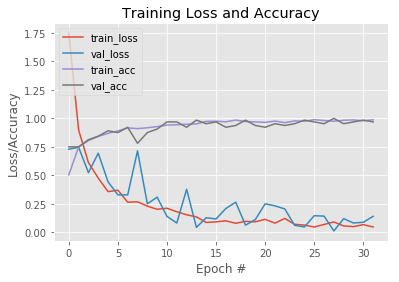

# Sign-Language-detection-for-Digits
Sign language detection for digits using deep learning

- I have trained the network on Google Colab.
- Keras framework was used for training the CNN.
- Following training and test accuracy were obtained

>Datasets used were open source and were downloaded from github. I have just randomly divided them into "train" and "validation" directory.

